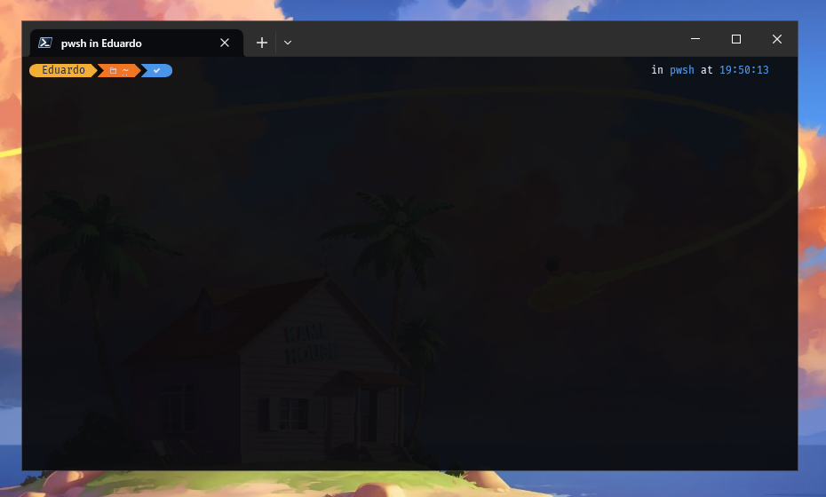
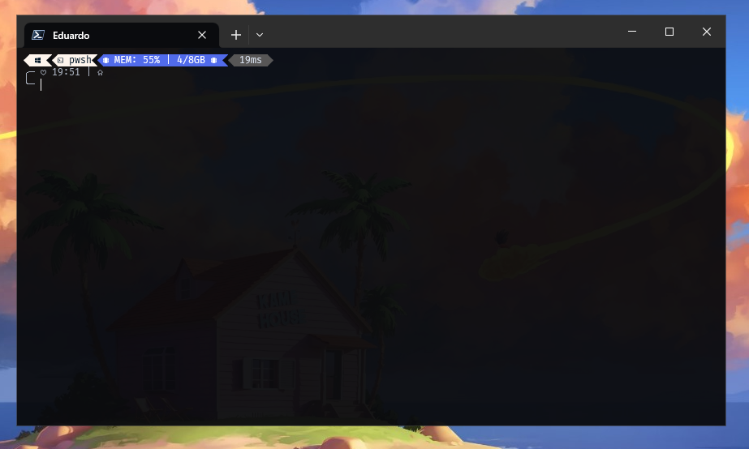

# Configuración de mi terminal

## Index

- [Instalar PowerShell](#instalar-powershell)
- [Instalar OhMyPosh - Estilo de la shell](#instalar-ohmyposh)

## Instalar PowerShell

Para instalar PowerShell en Windows desde la Microsoft Store, sigue los siguientes pasos:

1. Abre tu navegador web y ve al siguiente enlace: https://apps.microsoft.com/store/detail/powershell/9MZ1SNWT0N5D.

2. Una vez en la página de la tienda de Microsoft, haz clic en el botón "Obtener" o "Instalar". Esto te llevará a la página de la aplicación PowerShell en la Microsoft Store.

3. En la página de la aplicación PowerShell, haz clic en el botón "Obtener" o "Instalar" una vez más. Asegúrate de estar conectado a tu cuenta de Microsoft para que la instalación pueda llevarse a cabo.

4. La Microsoft Store iniciará automáticamente la descarga e instalación de PowerShell en tu dispositivo Windows. El progreso de la descarga se mostrará en la parte superior de la ventana de la Microsoft Store.

5. Después de que la instalación se complete, verás un mensaje indicando que PowerShell se ha instalado correctamente. También puedes encontrar el icono de PowerShell en tu menú de inicio o en la pantalla de inicio de Windows.

Ahora que has instalado PowerShell desde la Microsoft Store, tendrás acceso a una versión más actualizada de la shell de comandos de Microsoft. PowerShell ofrece una serie de características avanzadas y potentes que no se encuentran en la línea de comandos tradicional de Windows. Puedes utilizar PowerShell para automatizar tareas, administrar configuraciones del sistema y realizar una amplia gama de operaciones en entornos de Windows.

## Instalar OhMyPosh

### Instalación y configuración de Oh My Posh en PowerShell

Oh My Posh es una herramienta popular que permite personalizar y decorar la interfaz de la shell de PowerShell. Proporciona una gran variedad de temas y opciones de personalización para mejorar la apariencia y la experiencia de uso de la terminal. A continuación, se muestra un tutorial paso a paso sobre cómo instalar y configurar Oh My Posh en PowerShell.

### Requisitos previos:

- Tener PowerShell instalado en tu sistema.
- Acceso a Internet para descargar fuentes y el programa Oh My Posh.

### Pasos para la instalación

1.  Instalar una Nerdfont: Oh My Posh hace uso de iconos especiales que se encuentran en las Nerdfonts para dar estilo a la shell de PowerShell. Necesitarás instalar una Nerdfont de tu elección. Puedes descargar una Nerdfont compatible desde el sitio web oficial de Nerdfonts (por ejemplo, https://www.nerdfonts.com/) y seguir sus instrucciones de instalación.

2.  Instalar Oh My Posh: Abre una nueva instancia de PowerShell y ejecuta el siguiente comando para instalar Oh My Posh utilizando el administrador de paquetes winget:

    ```sh
    winget install JanDeDobbeleer.OhMyPosh -s winget
    ```

    Esto descargará e instalará Oh My Posh en tu sistema.

3.  Crear el archivo de configuración de la shell: Cierre la instancia actual de PowerShell y ábrela nuevamente para que los cambios tengan efecto. Luego, ejecuta el siguiente comando para crear el archivo de configuración de la shell de PowerShell:

    ```sh
    New-Item -Path $PROFILE -Type File -Force
    ```

    Este comando creará un archivo llamado `Microsoft.PowerShell_profile.ps1` que se guardara en la variable de entorno $PROFILE en tu perfil de usuario.

4.  Editar el archivo de configuración:
    Abre el archivo de configuración recién creado utilizando tu editor de código preferido. Puedes utilizar comandos como los siguientes:

    - Neovim:

      ```sh
      nvim $PROFILE
      ```

    - Vim:

      ```sh
      vim $PROFILE
      ```

    - Visual Studio Code:

      ```sh
      code $PROFILE
      ```

    - Bloc de notas:

      ```sh
        notepad $PROFILE
      ```

5.  Agrega el estilo por defecto de la configuración de Oh My Posh:
    Dentro del archivo de configuración, agrega la siguiente línea para configurar Oh My Posh y aplicar un estilo por defecto a la shell:

    ```sh
    oh-my-posh init --shell pwsh | Invoke-Expression
    ```

    Guarda el archivo después de realizar los cambios.

6.  Reiniciar PowerShell:
    Cierra la instancia actual de PowerShell y ábrela nuevamente. Si todo se configuró correctamente, deberías ver la shell de PowerShell con el nuevo estilo proporcionado por Oh My Posh.

#### Previsualización



### Personalizar estilos

Una vez que hayas instalado Oh My Posh y estés listo para asignar un estilo personalizado a tu shell de PowerShell, sigue estos pasos:

1. Instalar los estilos:
   Abre una instancia de PowerShell y ejecuta el siguiente comando para instalar los estilos disponibles utilizando el módulo Get-PoshThemes:

   ```sh
   Get-PoshThemes
   ```

   Esto descargará e instalará los estilos de Oh My Posh en tu sistema.

2. Abrir el archivo de configuración:
   Ahora, necesitarás abrir el archivo de configuración de PowerShell para realizar cambios. Puedes utilizar uno de los siguientes comandos según tu editor de código preferido:

   - Neovim:

     ```sh
     nvim $PROFILE
     ```

   - Vim:

     ```sh
     vim $PROFILE
     ```

   - Visual Studio Code:

     ```sh
     code $PROFILE
     ```

   - Bloc de notas:

     ```sh
       notepad $PROFILE
     ```

3. Agregar la configuración del estilo:
   Dentro del archivo de configuración, agrega la siguiente línea para asignar un tema específico a tu shell. Por ejemplo, vamos a asignar el tema `clean-detailed`:

   ```sh
   oh-my-posh init pwsh --config "$env:POSH_THEMES_PATH/clean-detailed.omp.json" | Invoke-Expression
   ```

   Puedes reemplazar "clean-detailed" con el nombre del tema que desees utilizar. Asegúrate de que el nombre del tema coincida exactamente con el archivo correspondiente en la ruta de configuración.

4. Guardar y aplicar los cambios:
   Guarda el archivo de configuración después de agregar la línea del estilo. Luego, cierra la instancia actual de PowerShell y ábrela nuevamente. Si todo se ha configurado correctamente, deberías ver tu shell de PowerShell con el nuevo estilo asignado.

   Recuerda que puedes explorar y elegir entre una variedad de temas disponibles en la página oficial de documentación de Oh My Posh, en la sección de temas (https://ohmyposh.dev/docs/themes). Puedes encontrar más información y ejemplos sobre cómo aplicar diferentes estilos a tu shell según tus preferencias.

#### Previsualización


