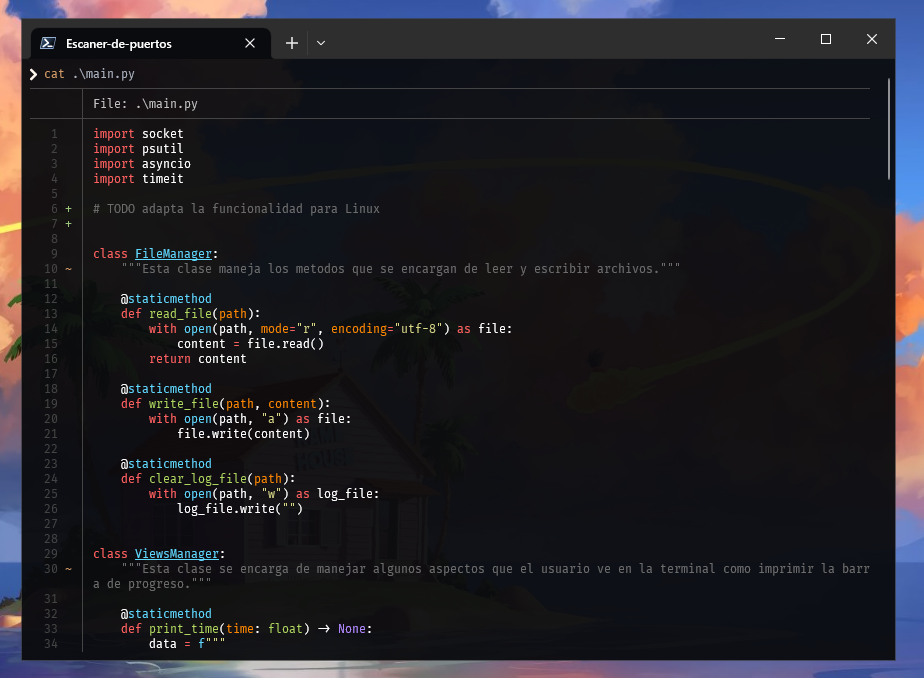
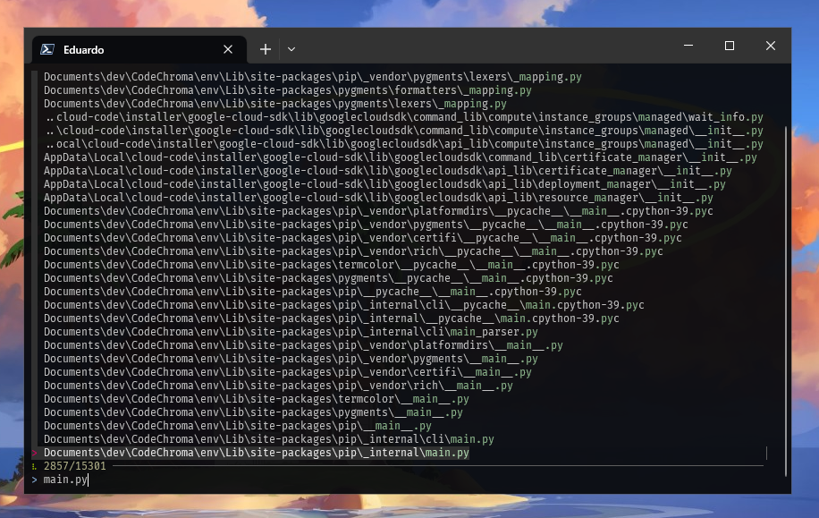
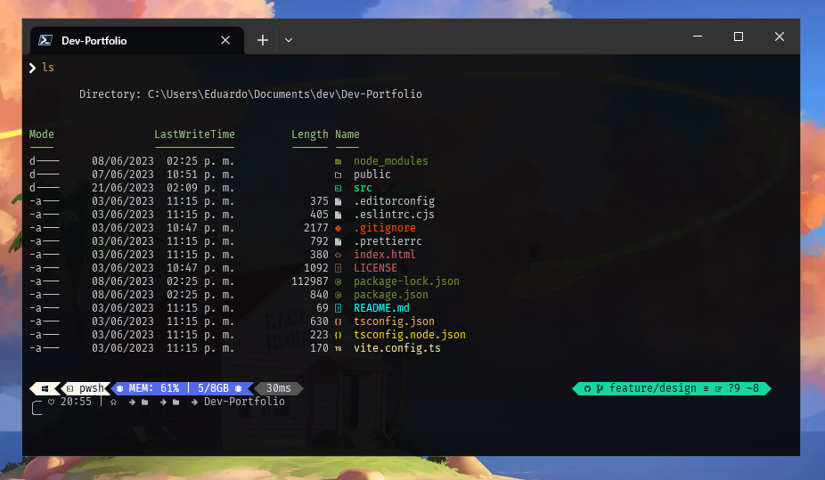

# Programas para la terminal

Para mejorar la experiencia y trabajar de manera más cómoda en la shell de PowerShell, se recomienda instalar algunos programas adicionales que proporcionan funcionalidades y características adicionales. Estos programas pueden ayudarte a ser más eficiente, facilitar la administración del sistema y brindar herramientas útiles para el desarrollo y la automatización de tareas. A continuación, te presento los que utilizo:

## Index

- [Bat - Muestra el contenido de un archivo](#bat)
- [Fzf - Busca archivos de manera inteligente](#fzf)
- [Terminal Icons - Muestra los iconos de cada archivo enlistado](#terminal-icons)

## Bat

Bat es un programa de línea de comandos que ofrece una funcionalidad similar a la función "cat" en Unix, pero con características adicionales que mejoran la visualización del contenido de archivos. Con Bat, puedes ver el contenido de archivos de texto con resaltado de sintaxis, números de línea y otras opciones de formato.

Al utilizar Bat, puedes navegar fácilmente por archivos grandes, revisar código fuente con resaltado de sintaxis y realizar búsquedas en el contenido de manera más eficiente. La capacidad de colorear la sintaxis es especialmente útil para resaltar palabras clave, cadenas, comentarios y otros elementos del código, lo que facilita la lectura y comprensión.

La instalación de Bat se puede realizar de varias formas:

- Chocolatey: Si tienes Chocolatey, un popular gestor de paquetes para Windows, instalado en tu sistema, puedes ejecutar el siguiente comando en una ventana de PowerShell o CMD con privilegios administrativos para instalar Bat:

  ```sh
  choco install bat
  ```

- Scoop: Si prefieres utilizar Scoop, otro gestor de paquetes para Windows, puedes ejecutar el siguiente comando en una ventana de PowerShell o CMD para instalar Bat:

  ```sh
  scoop install bat
  ```

- Descarga desde el repositorio original: Si deseas obtener los binarios directamente desde el repositorio oficial de Bat en GitHub, puedes dirigirte a la página https://github.com/sharkdp/bat y seguir las instrucciones proporcionadas por el creador del repositorio. Allí encontrarás las opciones para descargar y configurar Bat manualmente en tu sistema.

Una vez instalado, puedes utilizar Bat ejecutando el siguiente comando en la línea de comandos:

```
bat nombre_del_archivo
```

Esto mostrará el contenido del archivo con las características de resaltado de sintaxis y números de línea.

### Alias

Si deseas utilizar Bat como reemplazo de la función `cat` y asignar alias para facilitar su uso, puedes hacerlo modificando el archivo `Microsoft.PowerShell_profile.ps1`. Para ello, sigue los siguientes pasos:

1.  Abre una instancia de PowerShell y ejecuta el siguiente comando para abrir el archivo de perfil en el editor de código:

    - Neovim:

      ```sh
      nvim $PROFILE
      ```

    - Vim:

      ```sh
      vim $PROFILE
      ```

    - Visual Studio Code:

      ```sh
      code $PROFILE
      ```

    - Bloc de notas:

      ```sh
        notepad $PROFILE
      ```

2.  Dentro del archivo de perfil inserta las siguientes lineas de código:

    ```sh
    Remove-Alias cat -Force
    New-Alias -Name catl -Value bat
    New-Alias -Name catn -Value Get-Content
    function cat ($file) { bat --paging="never" $file }
    ```

    - `Remove-Alias cat -Force` eliminará cualquier alias existente para el comando "cat".
    - `New-Alias -Name catl -Value bat` creará un nuevo alias llamado "catl" que apuntará al comando "bat".
    - `New-Alias -Name catn -Value Get-Content` creará un nuevo alias llamado "catn" que apuntará al comando "Get-Content".
    - `function cat ($file) { bat --paging="never" $file }` definirá una nueva función llamada "cat" que utilizará el comando "bat" con la opción --paging="never" para deshabilitar la paginación y mostrar todo el contenido del archivo.

    Guarda los cambios y cierra el editor de código.

Para aplicar los cambios, cierra todas las instancias de PowerShell y ábrela nuevamente.

Después de realizar estos pasos, podrás utilizar los alias `catl` y `catn` para ejecutar los comandos `bat` y `Get-Content` respectivamente. Además, el comando `cat` ahora utilizará `bat` y mostrará el contenido completo del archivo sin paginación.

Recuerda que los cambios realizados en el archivo de perfil `Microsoft.PowerShell_profile.ps1` se aplicarán a todas las nuevas instancias de PowerShell que abras. Si deseas revertir estos cambios en el futuro, simplemente edita el archivo de perfil y elimina las líneas que agregaste.

### Previsualización



## Fzf

Fzf es una herramienta de línea de comandos que facilita la búsqueda y selección rápida de archivos y directorios en el sistema. Con Fzf, puedes navegar de manera eficiente a través de tu sistema de archivos y encontrar archivos de manera ágil mediante búsquedas interactivas.

Para instalar fzf, existen varias opciones dependiendo del gestor de paquetes que prefieras utilizar:

- Chocolatey: Si tienes Chocolatey, un gestor de paquetes para Windows, instalado en tu sistema, puedes ejecutar el siguiente comando en una ventana de PowerShell o CMD con privilegios administrativos:

  ```sh
  choco install fzf
  ```

- Scoop: Si prefieres utilizar Scoop, otro gestor de paquetes para Windows, puedes ejecutar el siguiente comando en una ventana de PowerShell o CMD:
  ```sh
    scoop install fzf
  ```
- Windows Package Manager (winget): Si utilizas Windows Package Manager (winget), un gestor de paquetes nativo de Windows, puedes ejecutar el siguiente comando en una ventana de PowerShell o CMD:

  ```sh
  winget install fzf
  ```

Cualquiera de estas opciones descargará e instalará Fzf en tu sistema, lo que te permitirá utilizarlo desde la línea de comandos.

Una vez instalado, puedes utilizar Fzf ejecutando el comando fzf seguido de las opciones y argumentos pertinentes. Fzf proporciona una interfaz interactiva en la que puedes escribir parte del nombre de un archivo o directorio para buscarlo y seleccionarlo de manera rápida. También ofrece otras características avanzadas, como la posibilidad de filtrar resultados, utilizar combinaciones de teclas para seleccionar múltiples archivos y más.

Explora la documentación de Fzf (https://github.com/junegunn/fzf) para conocer todas las funcionalidades y opciones disponibles. Con Fzf, encontrar y seleccionar archivos en tu sistema se vuelve más eficiente y conveniente, lo que mejora tu productividad en la línea de comandos.



## Terminal Icons

La instalación del módulo Terminal-Icons (https://github.com/devblackops/Terminal-Icons) permite mostrar la lista de elementos del comando ls (equivalente a dir en Windows) con sus respectivos iconos en PowerShell. Esto proporciona una representación visual más intuitiva de los archivos y directorios en la línea de comandos. A continuación, se explica cómo instalar y habilitar el módulo:

1. Abre una instancia de PowerShell con privilegios administrativos.

2. Ejecuta el siguiente comando para instalar el módulo Terminal-Icons desde el repositorio PSGallery:

   ```sh
   Install-Module -Name Terminal-Icons -Repository PSGallery
   ```

   Esto descargará e instalará el módulo Terminal-Icons en tu sistema.

3. Una vez completada la instalación, abre el archivo de perfil de configuración de PowerShell `Microsoft.PowerShell_profile.ps1` para realizar los ajustes necesarios. Puedes utilizar el siguiente comando para abrir el archivo de perfil con el editor de código de preferencia:

   - Neovim:

     ```sh
     nvim $PROFILE
     ```

   - Vim:

     ```sh
     vim $PROFILE
     ```

   - Visual Studio Code:

     ```sh
     code $PROFILE
     ```

   - Bloc de notas:

     ```sh
       notepad $PROFILE
     ```

4. Dentro del archivo de perfil, agrega la siguiente línea para importar el módulo Terminal-Icons:

   ```sh
   Import-Module -Name Terminal-Icons
   ```

   Esta línea cargará el módulo y habilitará su funcionalidad en cada instancia de PowerShell.

5. Guarda los cambios y cierra el editor de código.

Para aplicar los cambios, cierra todas las instancias de PowerShell y ábrela nuevamente.

Una vez completados estos pasos, al ejecutar el comando ls en PowerShell, verás los elementos listados con sus respectivos iconos, lo que facilitará la identificación de archivos y directorios según su tipo.

Recuerda que los cambios realizados en el archivo de perfil se aplicarán a todas las nuevas instancias de PowerShell que abras. Si deseas revertir estos cambios en el futuro, simplemente edita el archivo de perfil y elimina la línea que importa el módulo Terminal-Icons.

### Previsualización


